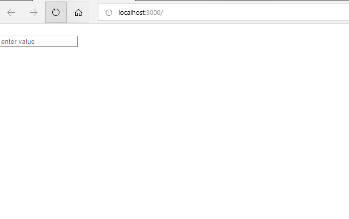
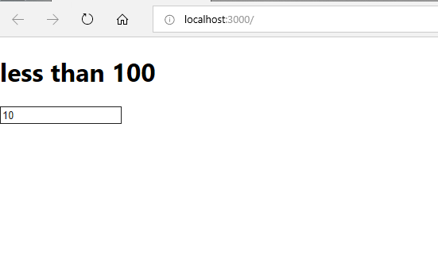
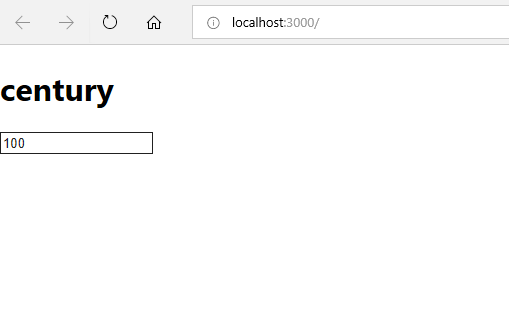
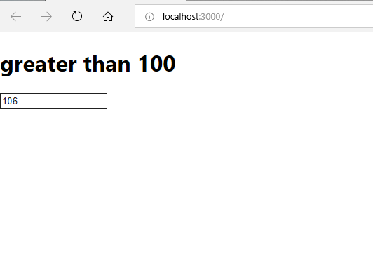

This project was bootstrapped with [Create React App](https://github.com/facebook/create-react-app).

<h2>State is a global object which is used to change UI of your web components. Only when state is update DOM is updated. You can't change state object directly, so we use setState function which changes the state and refreshes the DOM.<h2>
 
 Initial UI
  

   

  
  When input value less than 100  
 
  

  

when input value equals to 100  

   

  
  when input value greater than 100  
 
  

  

